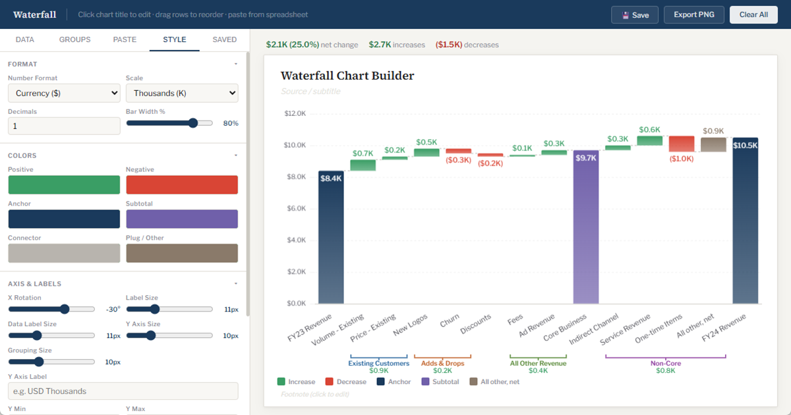

# Waterfall Chart Builder

Free, browser-based waterfall (bridge) chart builder. No sign-up, no server — everything runs locally in your browser.

**Live app:** https://reportingtools.vercel.app/

## Features

- **Increases, decreases, anchors, and subtotals** — build a full revenue or P&L bridge with drag-to-reorder rows
- **Tie-out mode** — set a known end value (e.g. FY24 Revenue) and an "All other, net" plug bar is calculated automatically so the chart always ties out
- **Paste from a spreadsheet** — tab- or space-separated data imports directly; opening/closing anchors are auto-detected, and accountant-style negatives like `(480)` are understood
- **Group brackets** — label spans of bars below the axis with a bracket and net sum (e.g. "Existing Customers")
- **Full styling control** — colors (custom picker), number format and scale, decimals, fonts, gridlines, bar width, axis bounds
- **Save & export** — save charts in your browser and export a presentation-ready PNG including the title, subtitle, legend, and footnote
- **JSON export/import** — download any chart as a `.waterfall.json` file and import it on another computer
- **Optional account sync** — sign in (email code or Google) to save charts to your account and open them from any computer

## Running locally

Clone the repo and open `index.html` in a browser. The app is fully self-contained — Chart.js is vendored in `vendor/`, so it works offline. Without the API deployed, the app runs in local-only mode (saves go to localStorage and the Sign in button is hidden).

## Cloud sync setup (Vercel + Neon)

The static app is served by Vercel with serverless functions in `api/`. To enable accounts and cloud saves:

1. **Database** — create a Neon Postgres database and run `schema.sql` in the Neon SQL editor.
2. **Auth** — enable Neon Auth on the Neon project. Add the app's domain (e.g. `https://reportingtools.vercel.app`) as a trusted origin in the Neon Auth settings, and enable the Email OTP method (and Google, optionally).
3. **Env vars** — in the Vercel project settings, set:
   - `DATABASE_URL` — the Neon connection string (added automatically if the database was created through the Vercel/Neon integration)
   - `NEON_AUTH_URL` — the Neon Auth base URL shown in the Neon console
4. Redeploy. The Sign in button appears automatically once `/api/config` reports an auth URL.

## License

[MIT](LICENSE)
